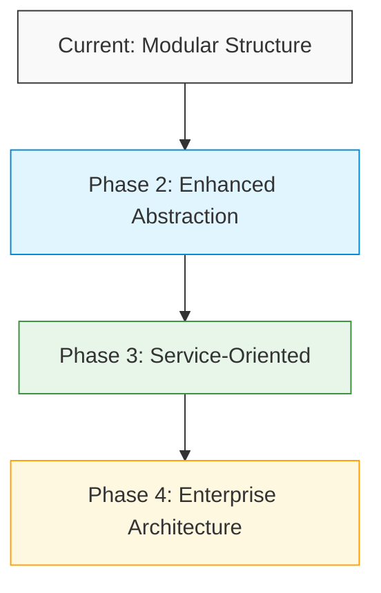
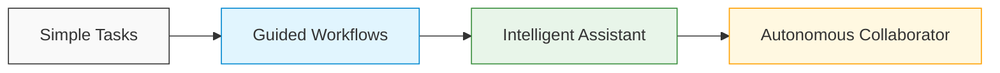

# Word GPT Plus: Evolution Roadmap

This document outlines the evolution strategy for Word GPT Plus, from its current state to a comprehensive AI writing assistant.

## Phase 1: Core Functionality (Current)

- ✅ Basic project structure and organization
- ✅ Integration with Word document context
- ✅ OpenAI API integration
- ✅ Simple text generation capabilities
- ✅ Settings management

## Phase 2: Enhanced Capabilities (1-3 months)

### AI Enhancements
- [ ] Implement recursive optimization for improved output quality
- [ ] Add multiverse writing with style variations
- [ ] Develop context-aware document analysis
- [ ] Create specialized templates for different document types

### Technical Improvements
- [ ] Support for multiple AI providers (Azure, Anthropic, local models)
- [ ] Implement robust error handling and recovery
- [ ] Add offline capabilities with local models
- [ ] Develop comprehensive test suite

### UX Improvements
- [ ] Create guided workflows for common tasks
- [ ] Implement progress indicators for long-running processes
- [ ] Add visual feedback for AI quality assessment
- [ ] Develop intuitive UI for comparing alternative generations

## Phase 3: Advanced Features (3-6 months)

### AI Capabilities
- [ ] Document-wide structure analysis and recommendations
- [ ] Smart formatting suggestions
- [ ] Citation and reference management
- [ ] Cross-reference and consistency checking
- [ ] Personalized writing style learning

### Integration
- [ ] Integration with research databases
- [ ] Citation style automation
- [ ] Image generation and manipulation
- [ ] Document template library

### Performance
- [ ] Parallel processing for long documents
- [ ] Background analysis and suggestions
- [ ] Intelligent caching for faster responses

## Phase 4: Enterprise and Advanced (6-12 months)

### Enterprise Features
- [ ] Team collaboration tools
- [ ] Custom model fine-tuning
- [ ] Organization-specific knowledge integration
- [ ] Centralized settings management
- [ ] Usage analytics and reporting

### Advanced Intelligence
- [ ] Multi-document contextual understanding
- [ ] Long-term user adaptation
- [ ] Specialized domain knowledge (legal, medical, academic)
- [ ] Automatic content updating from trusted sources
- [ ] Multilingual support with specialized quality metrics

### Ecosystem
- [ ] Excel, PowerPoint, and Outlook integration
- [ ] Web-based companion application
- [ ] Mobile companion for on-the-go editing
- [ ] API for third-party extensions

## Technical Evolution Strategy

### Architecture Evolution

1. **Current Architecture**
   - Modular structure with clear separation of concerns
   - Direct API integrations
   - Straightforward event system

2. **Phase 2: Enhanced Abstraction**
   - Provider-agnostic API layer
   - Improved event bus architecture
   - Plugin system for extensions

3. **Phase 3: Service-Oriented**
   - Microservices approach for scalable features
   - Background workers for intensive tasks
   - Advanced caching and state management

4. **Phase 4: Enterprise Architecture**
   - Distributed computing support
   - Multi-tenant capabilities
   - Enterprise authentication and security

### Performance Evolution

- **Response Time Targets**:
  - Phase 1: < 5 seconds for short generations
  - Phase 2: < 3 seconds for typical operations
  - Phase 3: < 2 seconds with background processing
  - Phase 4: < 1 second with predictive generation

- **Memory Management**:
  - Phase 1: Basic memory management
  - Phase 2: Optimized resource utilization
  - Phase 3: Advanced memory optimization
  - Phase 4: Intelligent resource allocation

## User Experience Evolution

### Interface Evolution

1. **Simple Tasks Interface (Current)**
   - Direct prompt-response model
   - Manual text insertion
   - Basic settings configuration

2. **Guided Workflows (Phase 2)**
   - Task-specific interfaces
   - Multi-step workflows with guidance
   - Visual feedback on quality

3. **Intelligent Assistant (Phase 3)**
   - Proactive suggestions
   - Context-aware interface adaptation
   - Personalized experience

4. **Autonomous Collaborator (Phase 4)**
   - Anticipates user needs
   - Learns from user behaviors
   - Adapts automatically to writing contexts

## Contribution and Development Roadmap

### Community Development

- **Phase 1**: Core team development
- **Phase 2**: Open for community contributions
- **Phase 3**: Plugin ecosystem
- **Phase 4**: Enterprise partner program

### Documentation Evolution

- **Phase 1**: Basic usage and setup documentation
- **Phase 2**: Comprehensive developer guides
- **Phase 3**: Advanced tutorials and examples
- **Phase 4**: Complete learning resources and certification

## Next Steps

### Immediate Priorities (Next 2 Weeks)

1. Complete core framework implementation
2. Implement basic recursive optimization
3. Develop document context analysis
4. Create initial specialized templates
5. Implement basic offline capabilities

### Key Performance Indicators

- Generation quality score > 8/10
- Response time < 3 seconds for standard operations
- User retention > 80% after first month
- Weekly active usage > 3 sessions per user

## Appendix: Feature Staging Details

[Detailed specifications for each feature will be developed as they move into implementation phase]
